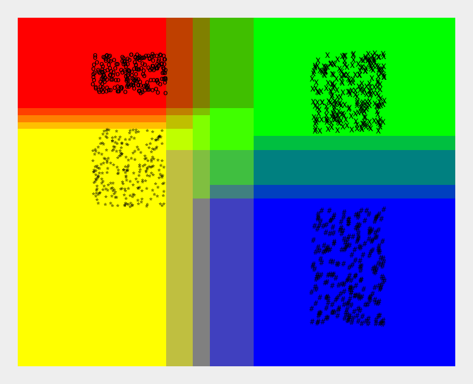
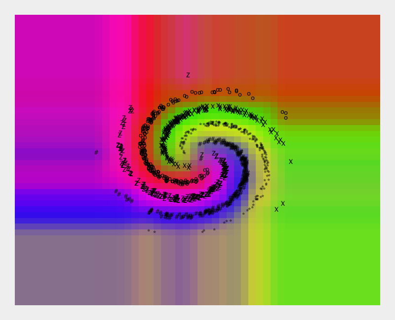

# Simple Random Forest Classifier #

This is a simple random forest classifier implementation in Java following the notes from the [technical report from MSR](https://www.microsoft.com/en-us/research/wp-content/uploads/2016/02/decisionForests_MSR_TR_2011_114.pdf).
Included is an axis-aligned learner which is tested on two synthetic datasets: a four-class uniformly distributed dataset and a five-class spiral dataset.  The unit tests for the axis-aligned learner also generate some nifty visualizations (roughly plotted via Java 2D), which are included below:




This implementation was originally created to help me understand how random forests work.  It's not optimized for performance.

Project setup uses gradle.  To get started, checkout and run,

```
./gradlew test
```
